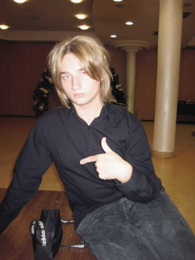
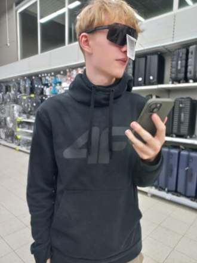

# JGS 🧑‍💻

JGS is a small full‑stack development team focused on modern web and application projects.

## Team 👥

<table>
  <tr>
    <td align="center">
      
       
      💻 Adam - "Hnato"
    </td>
    <td align="center">
      
       
      💻 Igor - "Flubi3604"
    </td>
    <td align="center">
      
       
      💻 Jakub - "John0G1thub"
    </td>
  </tr>
</table>

## Tech Stack 🧰

We work across the full stack and are comfortable with:

- **Languages:** 💻 C++, C#, Python, JavaScript, PHP  
- **Backend / Runtime:** 🖥️ Node.js  
- **Web:** 🌐 HTML, CSS  

## Latest Project 🚀

### 🦜 Parrotnest

Parrotnest is our modern real‑time chat and collaboration platform inspired by Discord.

You can see Parrotnest in action here:

- 🔗 https://pn.hnato.pl
- 🔗 https://pn.frodoinator.site
